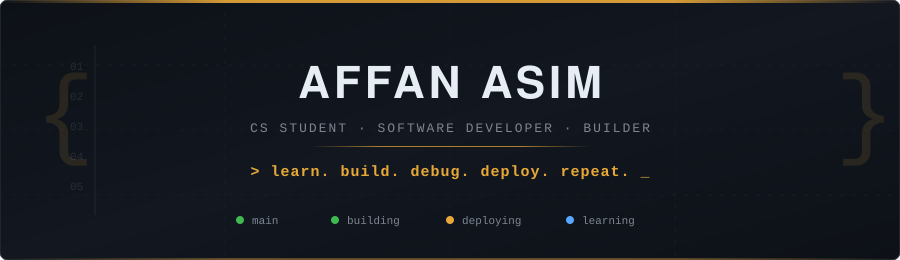
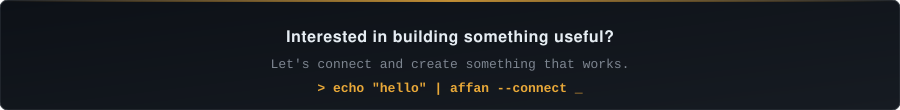

<div align="center">

<!-- ═══════════════════════════════════════════════════════════ -->
<!-- HERO SECTION -->
<!-- ═══════════════════════════════════════════════════════════ -->



<br/>

[](https://github.com/m-Affan55)
[](https://www.linkedin.com/in/affan-asim-896a90323/)
[](https://my-portfolio-five-azure-llvimsz11r.vercel.app/)
[](mailto:affanasimsaeed08@gmail.com)

</div>

<!-- ═══════════════════════════════════════════════════════════ -->
<!-- ABOUT ME -->
<!-- ═══════════════════════════════════════════════════════════ -->


### `> whoami`

```
BS Computer Science @ UET Lahore — Session 2024
```

I learn by building. Not tutorials — actual applications with backends, databases, deployments, and users.  
I'm interested in how software systems work end-to-end: from the API endpoint to the database query to the Docker container it runs in.

When something breaks, I debug it. When it's slow, I profile it. When it works, I deploy it.

Currently building increasingly complete systems that combine **mobile + backend + AI + deployment**.


<!-- ═══════════════════════════════════════════════════════════ -->
<!-- WHAT I BUILD -->
<!-- ═══════════════════════════════════════════════════════════ -->

### `> cat what-i-build.md`

<table>
<tr>
<td width="25%" valign="top">

**🧠 AI / ML**
<sub>

Recommendation systems  
AI-powered nutrition analysis  
Gemini API integration  
Data processing pipelines  
ML experimentation

</sub>
</td>
<td width="25%" valign="top">

**⚡ Web & APIs**
<sub>

FastAPI backends  
REST API design  
JWT authentication  
SQLAlchemy ORMs  
Redis caching layers

</sub>
</td>
<td width="25%" valign="top">

**📱 Mobile**
<sub>

Flutter applications  
Barcode scanning  
Real-time features  
Riverpod state management  
API integration

</sub>
</td>
<td width="25%" valign="top">

**🔧 Systems**
<sub>

Docker containerization  
PostgreSQL deployment  
Performance optimization  
Load testing with k6  
CI/CD configuration

</sub>
</td>
</tr>
</table>


<!-- ═══════════════════════════════════════════════════════════ -->
<!-- TERMINAL / BUILD ANIMATION -->
<!-- ═══════════════════════════════════════════════════════════ -->

<div align="center">

</div>


<!-- ═══════════════════════════════════════════════════════════ -->
<!-- FEATURED PROJECTS -->
<!-- ═══════════════════════════════════════════════════════════ -->

### `> ls ~/projects --featured`

<table>
<tr>
<td width="50%" valign="top">

#### [NutriSense](https://github.com/m-Affan55/NutriSense)

*Making nutrition tracking less manual.*

AI-powered meal tracking app that combines barcode scanning with intelligent food recognition. Scans a product → checks OpenFoodFacts → falls back to Gemini AI for estimation.

**Stack:** `Flutter` `FastAPI` `PostgreSQL` `Docker` `Gemini` `OpenFoodFacts`

**Engineering highlight:**
> Hybrid barcode intelligence — OpenFoodFacts for known products, Gemini AI fallback for everything else. Full backend with auth, deployed via Docker.

`MOBILE` `BACKEND` `AI` `DATABASE` `DEPLOYMENT`

</td>
<td width="50%" valign="top">

#### [Post-Manager](https://github.com/m-Affan55/Post-Manager)

*Building and optimizing a production-style REST backend.*

Complete social-style backend with authentication, CRUD operations, and real performance investigation — not just "it works" but "it works fast."

**Stack:** `FastAPI` `SQLAlchemy` `PostgreSQL` `Redis` `Docker` `k6` `JWT` `bcrypt`

**Engineering highlight:**
> Diagnosed N+1 queries and slow nested loads. Fixed with eager loading, joins, and Redis caching. Validated with k6 load testing at 10K requests.

`BACKEND` `PERFORMANCE` `CACHING` `TESTING`

</td>
</tr>
<tr>
<td width="50%" valign="top">

#### [MovieRecommendationSystem](https://github.com/m-Affan55/MovieRecommendationSystem)

*Recommendations based on what you actually like.*

A recommendation engine using graph databases to find meaningful connections between users and movies, not just simple collaborative filtering.

**Stack:** `FastAPI` `Neo4j` `PostgreSQL` `Streamlit` `Python`

**Engineering highlight:**
> Used Neo4j graph relationships to build recommendation logic that captures user-movie-genre connections beyond basic similarity scores.

`AI/DATA` `GRAPH DB` `BACKEND` `FULLSTACK`

</td>
<td width="50%" valign="top">

#### [NeoNotice](https://github.com/Muhammad-Umair-Tech/NeoNotice)

*Department notices pushed to physical displays — automatically.*

Full-stack notice management system built with React + Django. Notices posted through a web dashboard are pushed in real-time to LED displays via ESP32 microcontrollers over a local network.

**Stack:** `React` `Django` `ESP32` `Arduino` `REST API` `IoT`

**Engineering highlight:**
> Bridged software and hardware — Django REST backend receives notice submissions, formats payloads, and transmits to ESP32 over serial/network, driving physical LED panels without manual intervention.

`IOT` `FULLSTACK` `HARDWARE INTEGRATION` `REALTIME`

</td>
</tr>
</table>

<details>
<summary><b>📂 More Projects</b></summary>
<br/>

| Project | Tech | Description |
|---|---|---|
| [Food_Management](https://github.com/m-Affan55/Food_Management) | `C#` `Windows Forms` `MySQL` | Desktop food management system |
| [BankManagementSystem](https://github.com/m-Affan55/BankManagementSystem) | `C++` | Console-based banking application with OOP |
| [HostelManagementSystem](https://github.com/m-Affan55/HostelManagementSystem) | `C++` | Hostel management with file handling |
| [LARA](https://github.com/Muhammad-Umair-Tech/lara) | `Python` `Django` | SIEM app — detects transaction overflow, account takeover & suspicious activity for banking systems |

</details>


<!-- ═══════════════════════════════════════════════════════════ -->
<!-- TECH STACK -->
<!-- ═══════════════════════════════════════════════════════════ -->

### `> echo $TECH_STACK`

<table>
<tr>
<td valign="top" width="16%">

**Languages**


</td>
<td valign="top" width="14%">

**CS / Core**

`DSA`
`OOP`
`Problem Solving`
`DB Concepts`
`SE Fundamentals`

</td>
<td valign="top" width="14%">

**Web**


</td>
<td valign="top" width="14%">

**Mobile**


`Riverpod`

</td>
<td valign="top" width="14%">

**Data / AI**


`Gemini`

</td>
<td valign="top" width="14%">

**Databases**


</td>
</tr>
</table>

<table>
<tr>
<td valign="top" width="50%">

**DevOps / Deployment**


`k6`

</td>
<td valign="top" width="50%">

**Tools**


`MySQL Workbench`
`Anaconda`

</td>
</tr>
</table>


<!-- ═══════════════════════════════════════════════════════════ -->
<!-- ENGINEERING JOURNEY -->
<!-- ═══════════════════════════════════════════════════════════ -->

### `> git log --oneline --graph`

<div align="center">

</div>


<!-- ═══════════════════════════════════════════════════════════ -->
<!-- THINGS I'VE DEBUGGED -->
<!-- ═══════════════════════════════════════════════════════════ -->

### `> grep -r "FIXED" ~/debug-logs/`

I don't just build when everything works. I debug when it doesn't.

```
[FIXED]  N+1 database queries causing 200+ redundant SELECTs per request
[FIXED]  Slow API endpoints — diagnosed nested ORM loading, applied eager joins
[FIXED]  JWT token expiration and bcrypt compatibility across environments
[FIXED]  Docker deployment — PostgreSQL config, env variables, port mapping
[FIXED]  Redis cache invalidation strategy for frequently updated resources
[FIXED]  k6 load test failures revealing connection pool exhaustion
[FIXED]  Flutter camera lifecycle crashes during barcode scanning
[FIXED]  Barcode scanner state management across screen transitions
[FIXED]  API integration failures from malformed request serialization
[FIXED]  Environment configuration drift between dev, staging, and production
```


<!-- ═══════════════════════════════════════════════════════════ -->
<!-- CURRENTLY EXPLORING -->
<!-- ═══════════════════════════════════════════════════════════ -->

### `> cat ~/.learning/current.md`

<table>
<tr>
<td width="50%" valign="top">

**Deepening**

```
◆ Backend engineering patterns
◆ System design fundamentals
◆ AI/ML model training & evaluation
◆ Cloud infrastructure & DevOps
◆ Advanced mobile architecture
```

</td>
<td width="50%" valign="top">

**Current Focus**

```
◇ Writing production-quality code
◇ Understanding scalable architectures
◇ Building sophisticated AI applications
◇ Improving DSA & problem-solving
◇ Contributing to open source
```

</td>
</tr>
</table>


<!-- ═══════════════════════════════════════════════════════════ -->
<!-- GITHUB STATS -->
<!-- ═══════════════════════════════════════════════════════════ -->

### `> neofetch --stats`

<!-- DYNAMIC-STATS:START -->
<div align="center">

<table>
<tr>
<td align="center" width="25%">
<h3>&#128197; Saturday</h3>
<sub>September 26, 2026</sub>
</td>
<td align="center" width="25%">
<h3>&#128293; 0 days</h3>
<sub>Current Streak</sub>
</td>
<td align="center" width="25%">
<h3>&#128202; 439</h3>
<sub>Contributions this year</sub>
</td>
<td align="center" width="25%">
<h3>&#128187; 296</h3>
<sub>Commits this year</sub>
</td>
</tr>
</table>

<sup>&#9889; Auto-refreshed every 24h via GitHub Actions &nbsp;&#183;&nbsp; Live data from GitHub API</sup>

</div>
<!-- DYNAMIC-STATS:END -->

<div align="center">


&nbsp;&nbsp;


<br/><br/>


<sub>&#9889; Auto-refreshed every 24h via GitHub Actions &nbsp;&#183;&nbsp; Live data from GitHub API</sub>
<!-- STREAK-STATS:END -->

</div>


<!-- ═══════════════════════════════════════════════════════════ -->
<!-- FOOTER -->
<!-- ═══════════════════════════════════════════════════════════ -->

<div align="center">



<br/>

[](https://github.com/m-Affan55)
&nbsp;
[](https://www.linkedin.com/in/affan-asim-896a90323/)
&nbsp;
[](https://my-portfolio-five-azure-llvimsz11r.vercel.app/)
&nbsp;
[](mailto:affanasimsaeed08@gmail.com)

<br/>

<sub>Built with intention, not templates.</sub>

</div>
